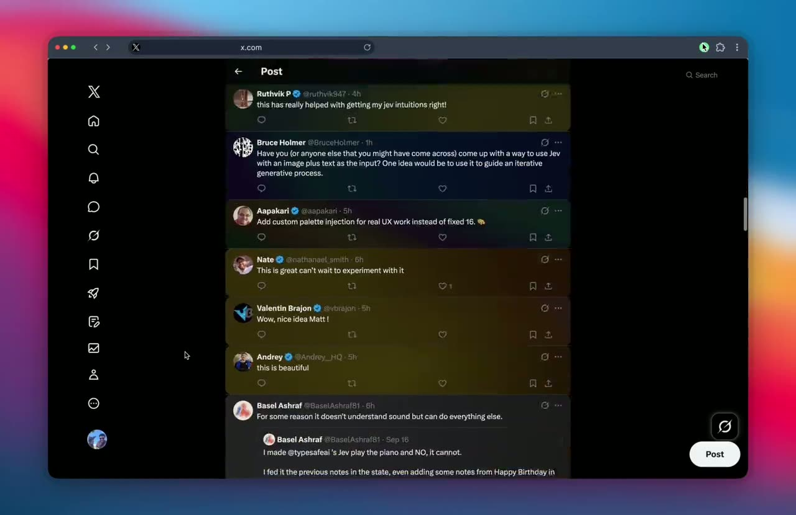

# Tweet Watercolour (Jev)

[](docs/demo.mp4)

<sup>▶ **[Play the 61-second demo](docs/demo.mp4)** — a live timeline, washed as it scrolls.</sup>

Chrome extension that paints every tweet with a watercolour wash mixed from the mood of its
words. Colours come from the [Bitframes](https://github.com/mattdesl/bitframes) palette `0x00`;
the mixing comes from [TypeSafe AI's Jev](https://vercel.com/ai-gateway/models/jev) via the
Vercel AI Gateway. No account, no build step, no dependencies.

Not useful. That is the point.

## The idea

A `choice` question returns a probability for **every** option, not just the winner. Ask jev
what colour a tweet is, with thirteen palette colours as the options, and one call gives back
a distribution across the whole palette — and a distribution over colours is already a gradient.

Measured on real tweets:

```
rage       -> red 100%
grief      -> dark blue 100%
joy        -> hot pink 71%  yellow 27%
calm       -> teal 71%  light blue 29%
mundane    -> gray 100%
anxiety    -> dark blue 52%  indigo 46%
whimsy     -> yellow 66%  orange 20%  hot pink 8%
nostalgia  -> indigo 37%  light pink 29%  brown 18%  orange 11%
```

Nine tweets in one 622ms call, $0.000153.

The nice part is emergent: a tweet with one strong feeling spikes to a single colour and washes
flat, while an ambivalent one spreads across three or four and comes out genuinely mixed.
**The more complicated the feeling, the richer the gradient.** Nothing was built for that — it
falls out of the answer shape.

## Look at it without installing anything

```bash
node dev/make-preview.mjs && open dev/preview.html
```

A standalone page with the real measured washes baked in, light and dark, with each tweet's
actual mix printed underneath.

## Install

1. Get a Vercel AI Gateway key (Vercel dashboard → AI Gateway → API Keys).
2. `chrome://extensions` → Developer mode → Load unpacked → pick this folder.
3. Pin it: the puzzle-piece 🧩 in the toolbar → pin *Tweet Watercolour*. Chrome hides newly
   loaded extensions, and the **Update** button only reloads code — it never opens the popup.
4. Click the icon, paste the key, **Save key**.

Wash intensity is a slider in the popup.

This is a **separate extension** from Pitch Dimmer, not an update to it: its own folder, its
own Chrome entry, its own API key field, its own icon (four overlapping palette washes rather
than the blue robot). Load unpacked again for this folder.

Both match `https://x.com/*`, so if both are enabled they run together. Nothing breaks, but a
tweet the dimmer flags as selling gets dropped to 25% opacity, which fades its wash along with
everything else. If the washes look muddy, that is usually the other extension — untick one.

## How the wash is built

Two layers, both seeded from the tweet id so a tweet looks identical every time it scrolls back:

- a **linear spectrum** whose stops are sized by each colour's weight, which covers the whole
  element
- two or three **oversized radial blooms** on top, for the mottling that makes it read as paint
  rather than as a UI gradient

The first version was radial blobs only. It was nearly invisible, and turning the intensity up
changed nothing — because the problem was coverage, not opacity. A tweet is about 340x45px, so
percentage-sized ellipses came out as slivers that faded to transparent well inside the element.

## Three things learned the hard way

Carried over from the earlier dimming extension, plus one new one:

**Never style with a class or an inline style.** Twitter rewrites `className` on hover and on
every rerender, and React owns the `style` attribute. Each tweet instead gets its own injected
stylesheet rule keyed by a `data-` attribute, because React leaves `data-*` attributes it did
not set alone. That is the only thing that reliably survives.

**The observer must watch attributes.** `{childList, subtree}` does not fire on a `className`
change, which is exactly the mutation Twitter makes most often.

**Do not gate rendering behind `requestAnimationFrame`.** rAF is suspended in a hidden tab, so
with the timeline open in a background tab the stylesheet flush never ran: every tweet was
tagged and none was painted. Writing a stylesheet is not animation work; `setTimeout` is correct.

## Queue

Same bounded queue as before: tweets are enqueued on entering the viewport, dropped on leaving
if not yet painted, and the queue is capped so a fast scroll does not pay for tweets that are
already gone.

One bug worth recording: the cap used to evict the oldest tweet even when it was still on
screen, and because it stayed intersecting no further IntersectionObserver event ever fired to
re-enqueue it — it sat blank permanently. `pump()` now tops the queue up from whatever is
visible and unpainted.

## Cost

About $0.00002 per tweet. A long scrolling session is a fraction of a cent.
